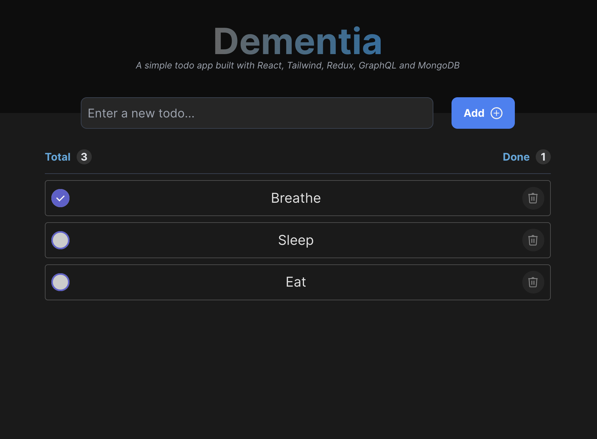

# Todo App

This monorepo contains both the frontend and backend components of a todo list application built using React, Redux, TypeScript, GraphQL, and MongoDB. The application allows users to manage their tasks through a user-friendly interface.



## Table of Contents

- [Features](#features)
- [Project Structure](#project-structure)
- [Getting Started](#getting-started)
- [Usage](#usage)
- [Technologies Used](#technologies-used)

## Features

- Create, read, update, and delete tasks in a todo list.
- GraphQL API for interacting with tasks data.
- User-friendly interface built using React and Redux.
- Styled with Tailwind CSS for responsive design.
- Docker files provided for containerization.

## Project Structure

The project is organized into two main directories: `frontend` and `backend`.

- `frontend`: Contains the React frontend code for the application.
- `backend`: Contains the Node.js backend code, including API routes, controllers, models, and GraphQL setup.
- `docker`: Includes Docker files for both frontend and backend containerization.

## Getting Started

To get started with the Todo App, follow these steps:

1. Clone this repository:

   ```bash
   git clone https://github.com/your-username/todo-app.git
   cd todo-app
   ```

2. Set up the environment variables:

   - Create a `.env` file in both `frontend` and `backend` directories based on the `.env.example` files.

   **Backend `.env`**:
   ```env
   MONGO_URI=mongodb+srv://<username>:<password>@<cluster-address>/<database>?retryWrites=true&w=majority
   JWT_SECRET=<your_jwt_secret>
   ```

   **Frontend `.env`**:
   ```env
   VITE_API_URL=http://localhost:3000
   ```

3. Install dependencies for both frontend and backend:

   **Backend**:
   ```bash
   cd backend
   npm install
   ```

   **Frontend**:
   ```bash
   cd frontend
   npm install
   ```

4. Start the development servers:

   **Backend**:
   ```bash
   cd backend
   npm run dev
   ```

   **Frontend**:
   ```bash
   cd frontend
   npm run dev
   ```

5. Open your browser and navigate to `http://localhost:5173` to view the frontend application.

## Usage

- **Development**: Use `npm run dev` in both `frontend` and `backend` directories to start development servers.
- **Production**: Use `npm run build` followed by `npm start` for both frontend and backend to build and run the production version of the app.

## Technologies Used

- **Frontend**:
   - React
   - Redux
   - TypeScript
   - Tailwind CSS
   - Vite

- **Backend**:
   - Node.js
   - Express
   - GraphQL
   - Apollo Server
   - MongoDB
   - TypeScript
   - Jest

- **Tooling**:
   - Docker
   - ESLint
   - Prettier

