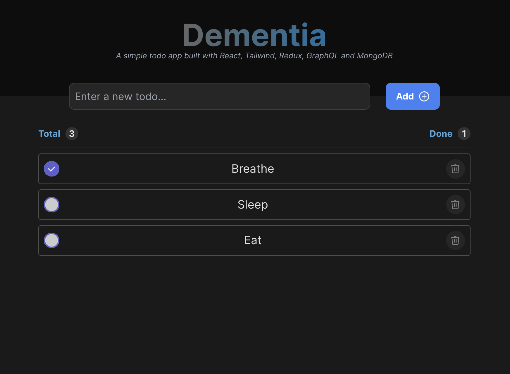

# Todo App

A simple todo application built using React, Redux, Apollo Client, and Tailwind CSS.



## Table of Contents

- [Overview](#overview)
- [Features](#features)
- [Installation](#installation)
- [Usage](#usage)
- [Technologies](#technologies)
- [Directory Structure](#directory-structure)
- [Contributing](#contributing)
- [License](#license)

## Overview

This is a basic todo app that allows users to manage their tasks. Users can create, edit, and remove todos, while keeping track of their completion status. The app is built using popular frontend libraries and tools like React, Redux for state management, Apollo Client for GraphQL integration, and Tailwind CSS for styling.

## Features

- Create new todo items
- Edit existing todo items
- Mark todo items as complete
- Remove todo items
- Real-time updates using Apollo Client and GraphQL
- Responsive and modern UI with Tailwind CSS

## Installation

1. Clone the repository:
   ```bash
   git clone https://github.com/yourusername/todo-app.git
   ```

2. Navigate to the project directory:
   ```bash
   cd todo-app
   ```

3. Install dependencies:
   ```bash
   npm install
   ```

## Usage

1. Start the development server:
   ```bash
   npm run dev
   ```

2. Open your browser and visit `http://localhost:3000` to use the app.

## Technologies

- React: A JavaScript library for building user interfaces.
- Redux: A state management library for managing the application's state.
- Apollo Client: A powerful GraphQL client for fetching and managing data.
- Tailwind CSS: A utility-first CSS framework for building modern and responsive designs.

## Directory Structure

Here's an overview of the project's directory structure:

```
- backend/                  # Backend code (if applicable)
- frontend/                 # Frontend code
  - public/                 # Public assets and HTML
  - src/                     # Source code
    - assets/                # Images, icons, etc.
    - components/            # Reusable React components
      - atoms/                # Atomic UI components
      - molecules/            # UI components composed of atoms
    - graphql/               # GraphQL queries and mutations
      - mutations/            # GraphQL mutation queries
      - queries/              # GraphQL query queries
    - store/                  # Redux store configuration and setup
      - actions/              # Redux action creators
      - reducers/             # Redux reducers
      - types/                # Type definitions for Redux
    - App.tsx                 # Main application component
    - index.tsx               # Entry point for React
    - index.css               # Global styles
    - apolloClient.ts         # Apollo Client setup
  - ...
- node_modules/              # Node.js dependencies (automatically generated)
- .gitignore                 # List of files/folders to ignore in version control
- package.json               # Project configuration and dependencies
- README.md                  # Project documentation
- ...                        # Other configuration files
```

## Contributing

Contributions are welcome! If you find any issues or want to add new features, feel free to open a pull request. For major changes, please open an issue first to discuss the proposed changes.

## License

This project is licensed under the [MIT License](LICENSE).
```

Make sure to replace placeholders like `yourusername` with your actual GitHub username and adjust the content to match your project's specifics.